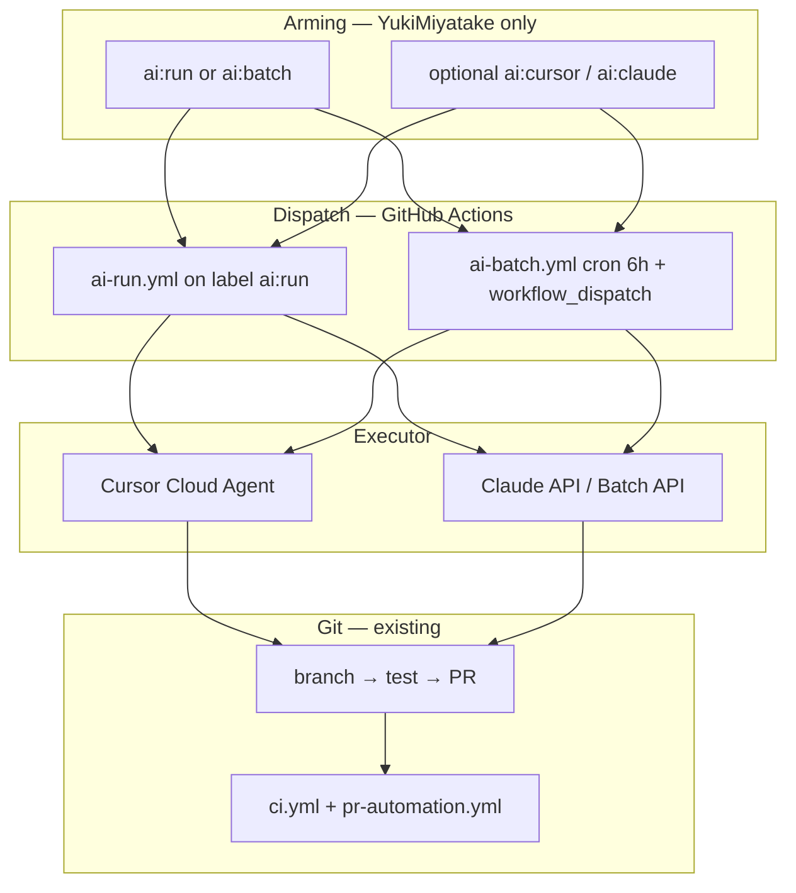

# Issue-driven AI execution (design)

> **Languages:** English (this file) · [日本語](../ja/dev/ai-issues.md)

> **Scope — not a product feature**  
> This document applies **only to developing the CostGate repository itself** (`YukiMiyatake/costgate`).  
> It is **maintainer-only** automation (Issue → AI → PR for this repo).  
> It is **not** part of the CostGate OSS product, **not** part of LoopGate Cloud, and **not** a template for customer repos.

Design for **maintainer-only**, label-gated AI coding from GitHub Issues on **this repository**.  
Implementation (workflows, executors) is phased; this document is the contract.

| Item | Decision |
|------|----------|
| **Who can arm an issue** | `YukiMiyatake` only (`github.actor` on label/comment). `MEMBER` / outside contributors **cannot** trigger runs. |
| **Default executor** | **Cursor** (Cloud Agent or equivalent) |
| **Alternate executor** | **Claude API** (selected via label) |
| **Immediate queue** | Label `ai:run` |
| **Batch queue** | Label `ai:batch` — processed every **6 hours**, max **3 issues** per batch |
| **AI responsibility** | Open a PR only; **CI / review / auto-merge** stay in GitHub Actions (see [CONTRIBUTING.md](../../CONTRIBUTING.md)) |

---

## 1. Goals and non-goals

### Goals

- Turn a scoped Issue into a tested PR without running every open Issue automatically.
- Support **immediate** and **cost-aware batch** scheduling on the same label model.
- Allow **executor choice** (Cursor vs Claude) without duplicating queue labels.
- Leave room for a future **triage agent** that arms Issues on behalf of the maintainer (still subject to authorization).

### Non-goals (initial)

- Auto-run on `issues.opened`.
- Trust Issue bodies from arbitrary reporters (only structured blocks + title).
- Auto-merge AI PRs by default (can be enabled later per label).
- Full costgate-cloud queue (optional later).

---

## 2. Authorization

Public repos must **never** trigger on “label exists” alone. Always verify **who armed the Issue**.

### Allowed arming actions

Only when **`github.actor == 'YukiMiyatake'`**:

- Adding queue label `ai:run` or `ai:batch`
- Adding executor label `ai:cursor` or `ai:claude`
- Comment command `/ai run` or `/ai batch` (optional; bot may mirror to labels)
- `workflow_dispatch` on AI workflows (GitHub UI — repo write access)

**Not allowed:** `MEMBER`, `CONTRIBUTOR`, `NONE`, fork workflows with secrets, `issues.opened`.

### Scheduled batch runs

`schedule` (cron) has no human `actor`. Safety rules:

1. Only Issues that already have `ai:batch` **and** were armed by a verified event (label added by `YukiMiyatake`, recorded in an Issue comment).
2. Batch workflow does not accept arbitrary Issue numbers from inputs—only scans the label.
3. Optional hardening later: `repository_dispatch` from costgate-cloud with a secret instead of public cron.

### Arm audit comment

When an Issue is armed, a bot comment (future workflow) should record:

```markdown
<!-- costgate-ai-armed:v1 -->
actor: YukiMiyatake
queue: batch
executor: cursor
armed_at: 2026-07-09T02:00:00Z
```

---

## 3. Labels

### Queue (pick one)

| Label | Meaning |
|-------|---------|
| `ai:run` | Run as soon as the immediate dispatcher picks it up (one Issue → one run). |
| `ai:batch` | Wait for the **6-hour** batch job; max **3** Issues per run (oldest armed first). |

Mutually exclusive. If both are present, workflow should fail closed and comment.

### Executor (optional; default Cursor)

| Label | Meaning |
|-------|---------|
| `ai:cursor` | Use **Cursor** agent (default when omitted). |
| `ai:claude` | Use **Claude API** (Batch API when queue is `ai:batch`, if applicable). |

If both executor labels are present, fail closed.

**Resolution:**

```
executor = ai:claude if label present else cursor
```

### State (bot-managed)

| Label | Meaning |
|-------|---------|
| `ai:running` | Executor workflow in progress. |
| `ai:pr-open` | PR created; link in comment. |
| `ai:done` | PR merged or explicitly closed. |
| `ai:failed` | Run failed; logs linked. |
| `ai:blocked` | Needs human input (ambiguous scope, etc.). |

Humans should not toggle state labels manually except `ai:blocked`.

### Examples

| Labels | Behavior |
|--------|----------|
| `ai:batch` | Batch in ≤6h, Cursor, default executor. |
| `ai:batch` + `ai:claude` | Batch in ≤6h, Claude executor. |
| `ai:run` + `ai:cursor` | Immediate Cursor run. |
| `ai:run` + `ai:claude` | Immediate Claude run. |

---

## 4. Issue instruction block

Armed Issues should include a machine-readable scope block (maintainer-edited):

```markdown
<!-- costgate-ai:v1 -->
queue: batch
executor: claude
scope:
  - scripts/lib/prompt-history.mjs
test:
  - npm run test:ci
constraints:
  - Do not change release version
notes: |
  Fix correlation label only.
```

Workflows parse **only** this block for file scope and test commands. Free-form Issue text is context for the agent, not authorization.

---

## 5. Execution flow



### Immediate (`ai:run`)

1. `issues.labeled` → verify `github.actor == 'YukiMiyatake'` and label `ai:run`.
2. Resolve executor (`cursor` | `claude`).
3. Set `ai:running`, dispatch executor with Issue number + `costgate-ai:v1` payload.
4. Executor: `feat:start` → implement → `npm run test:ci` (or scoped tests) → `feat:ship` (PR only).
5. Comment PR URL, set `ai:pr-open`, remove `ai:running`.

### Batch (`ai:batch`)

| Parameter | Value |
|-----------|-------|
| Cron | `0 */6 * * *` (every 6 hours UTC) |
| Max issues per run | **3** |
| Order | Oldest `ai:batch` armed first (`created_at` / arm comment timestamp) |
| Skip | Issues already labeled `ai:running`, `ai:pr-open`, `ai:done` |

For each selected Issue:

1. Same executor resolution as immediate.
2. For `ai:claude` + batch queue, prefer **Claude Message Batches API** when tasks are doc/test-only (cost).
3. Sequential or low parallelism (1 at a time initially) to avoid branch conflicts.

Manual **“run batch now”**: `workflow_dispatch` on `ai-batch.yml` (maintainer only).

---

## 6. Executor notes

### Cursor (default)

- Best for multi-file changes, Gate + Dashboard, local integration tests.
- Aligns with `npm run feat:ship` and existing Cursor hooks.
- One Issue → one agent session recommended.

### Claude (`ai:claude`)

- Best for smaller, well-scoped tasks (docs, tests, isolated modules).
- Batch queue + Claude Batch API for cost savings on non-urgent work.
- Output still lands as a git branch + PR (Actions or a thin wrapper script); no direct push to `main`.

---

## 7. PR and CI policy

| Rule | Value |
|------|-------|
| Branch prefix | `ai/issue-<num>-<slug>` |
| PR title | `[ai] #<num> <summary>` |
| Merge | GitHub Actions CI; auto-merge **off for `ai:*` PRs** until explicitly enabled |
| Required checks | Same as `ci.yml` |

---

## 8. Future: triage agent

A separate **triage** identity may:

- Split large Issues.
- Propose `costgate-ai:v1` blocks.
- Suggest labels.

It **must not** bypass arming rules: either

- triage opens a sub-Issue and **waits for maintainer** to add `ai:run` / `ai:batch`, or
- triage uses a dedicated GitHub App allowed in `AI_ALLOWED_APPS` (documented later).

---

## 9. Implementation phases

| Phase | Deliverable |
|-------|-------------|
| **A** (this doc) | Label contract + authorization |
| **B** | `.github/workflows/ai-run.yml` — immediate dispatch |
| **C** | `.github/workflows/ai-batch.yml` — 6h / 3 issues |
| **D** | Cursor Cloud dispatch adapter |
| **E** | Claude API + Batch API adapter |
| **F** | Triage agent integration (costgate-cloud) |

---

## 10. Related docs

- [CONTRIBUTING.md](../../CONTRIBUTING.md) — `feat:ship`, GitHub Actions merge policy
- [shield-trust.md](./shield-trust.md) — MCP trust (executor environments)
- [roadmap.md](../roadmap.md) — phase tracking
