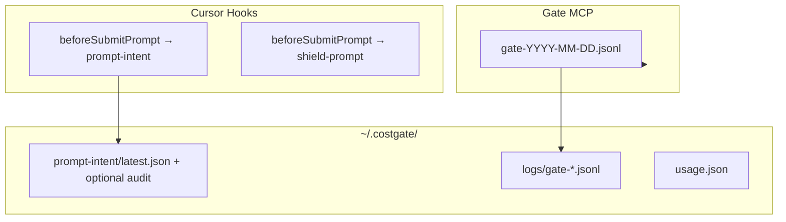

# Prompt History — Dashboard 履歴タブ企画

ユーザーが AI に送ったプロンプト周辺の MCP 活動（tools/list・tool_call・トークン・削減量）を Dashboard で一覧し、気になった行を Export する機能の実装検討とフェーズ計画。

| 項目 | 内容 |
|------|------|
| **目的** | 直近 N ターンのコスト可視化・デバッグ・eval 用データ抽出 |
| **非目的** | LLM 応答全文の保存、Cursor 課金トークンの正確な再現、Cloud 共有（Phase 30+） |
| **前提** | Gate JSONL、prompt-intent hook、Dashboard API/UI、既存 token 計測が稼働 |
| **関連** | [prompt-intent-hook.md](./prompt-intent-hook.md)、[log-schema.md](../log-schema.md)、[optimize-sweep.md](./optimize-sweep.md)、[dashboard.md](./dashboard.md) |

---

## 1. ユーザーストーリー

| # | ストーリー | 受け入れ基準 |
|---|-----------|-------------|
| U1 | Dashboard に「履歴」メニューで直近のやり取りを見たい | 既定 50 件以内を新しい順に一覧 |
| U2 | 1 回のプロンプト送信に紐づく MCP 活動をまとめて見たい | 1 行 = 1 `generation`（後述）としてグルーピング |
| U3 | トークンと削減量を把握したい | tools/list 推定 tok、tool_call tok、`saved_bytes` 集計を表示 |
| U4 | どの Tool が呼ばれたか知りたい | ツール名チップ + 詳細パネル |
| U5 | 気になった行だけ Export したい | JSON ダウンロード（単体 / 複数選択） |

---

## 2. 現状データ（使える / 足りない）

### 2.1 既に取れているもの



| データ | 所在 | 履歴向き |
|--------|------|---------|
| `conversation_id`, `generation_id` | prompt-intent hook | **ターン相関の主キー** |
| keywords / templates / scores | `prompt-intent/latest.json` | 一覧ラベル（全文の代替） |
| `prompt_preview`（先頭 80 字） | `COSTGATE_PROMPT_INTENT_PREVIEW=1` 時 | 一覧プレビュー |
| tools_list 露出数・tokens_est | gate JSONL `gate_event.tools_list` | 固定コスト |
| tool_call・compressed・saved_bytes | gate JSONL `gate_event.tool_call` | 変動コスト・削減 |
| ブロック時の全文 prompt | shield-prompt `latest.json` | 失敗ケースのみ |
| Probe セッション | probe JSONL `session_id` | 計測モード専用 |

### 2.2 足りないもの（本機能で埋める）

| ギャップ | 影響 |
|---------|------|
| Gate JSONL に `generation_id` なし | プロンプト ↔ tool_call を機械的に結合できない |
| prompt-intent は `latest.json` 上書き | 履歴が残らない（audit は opt-in のみ） |
| Dashboard に履歴 API / UI なし | 表示不可 |
| gate `saved_bytes` の UI 集計なし | 削減量が見えない |
| LLM 応答・Cursor 内部 SSE | **CostGate の観測範囲外** |

---

## 3. 「1 回のプロンプト SSE」グルーピングの可否

### 3.1 結論

| 方式 | 可否 | 説明 |
|------|------|------|
| Cursor の HTTP/SSE ストリームをそのまま再現 | **不可** | CostGate は LLM ストリームに非介入 |
| 1 ユーザー送信 = 1 グループ | **可能（推奨）** | Cursor hook の `generation_id` を軸にする |
| 1 会話スレッド = 1 グループ | **可能（補助）** | `conversation_id` でフィルタ / 折りたたみ |
| 時間窓のみでのクラスタリング | **フォールバック** | ID 欠落時に prompt ts ± 窓で gate イベントを紐付け |

### 3.2 `generation_id` をターン ID とみなす理由

Cursor `beforeSubmitPrompt` は **ユーザーが Enter を押した 1 回**ごとに発火し、`generation_id` が付与される。以降の Agent ループ（tools/list 再取得、複数 tool_call、内部リトライ）は同一 generation に属する。

```
[ユーザー Enter]
    → generation_id = G1  (prompt-intent に記録)
    → tools/list (複数回あり得る)
    → tool_call × N
    → (Cursor 内部で LLM 応答 — CostGate は未観測)
[次のユーザー Enter]
    → generation_id = G2
```

これはユーザーが想定する「1 回投げたプロンプトのまとまり」に **実用上最も近い** 単位。厳密な SSE フレーム境界ではないが、Dashboard 用途では十分。

### 3.3 紐付けアルゴリズム

```
1. turns.jsonl からターン境界タイムラインを構築（各 turn.ts 〜 次 turn.ts）
2. gate JSONL イベント E に generation_id があればその ID で JOIN（主キー）
3. generation_id がなければターン境界から推定（generation_inferred）:
     window_start = H.ts - (tools_list のみ 30min lookback)
     window_end   = 次の H'.ts または H.ts + 30min
     conversation_id / workspace_root が一致する H を選び E.generation_id を補完
4. 誤った generation_id は時間で上書きしない（別ターンに誤結合しない）
5. ターン集計:
     tools_list_tokens = Σ E.tokens_est (event=tools_list)
     tool_call_tokens  = Σ bytes/4 or tiktoken (event=tool_call)
     saved_tokens      = Σ saved_bytes/4
     tools_called      = unique(E.tool)
```

Gate 書き込み時は `latest.json`（10分 TTL）→ 失敗時 `turns.jsonl` の現行ターンから `generation_id` をスタンプ（[generationtimeline.go](../../packages/gate/internal/usage/generationtimeline.go)）。

### 3.4 限界（UI に明記する）

- **LLM 応答テキスト**は表示しない（取得経路なし）
- **システムプロンプト / rules トークン**は対象外（[dashboard.md](../dashboard.md) と同様）
- Gate 再起動直後は `generation_id` 未付与イベントが `generation_inferred` になる可能性（UI の相関ラベル参照）
- 複数ワークスペース同時利用時は `workspace_root` フィルタ必須

---

## 4. データモデル（新規）

### 4.1 ターンインデックス（append-only）

**パス:** `~/.costgate/history/turns.jsonl`（新規）

```json
{
  "type": "turn",
  "ts": "2026-07-08T10:00:00.000Z",
  "conversation_id": "conv-abc",
  "generation_id": "gen-xyz",
  "workspace_root": "/path/to/project",
  "client": "cursor",
  "prompt_preview": "GitHub の PR を一覧して…",
  "keywords": "github pull request",
  "templates": ["github"],
  "intent_scores": { "github": 1.0 }
}
```

- prompt-intent hook から **常時 append**（`latest.json` は従来どおり Gate 用に維持）
- プレビュー長: 既定 120 文字、0 = キーワードのみ
- 全文保存: `COSTGATE_HISTORY_PROMPT=full` で opt-in（ローカルのみ）

### 4.2 Gate JSONL 拡張

`gate_event` に任意フィールドを追加:

```json
{
  "type": "gate_event",
  "event": "tool_call",
  "ts": "...",
  "generation_id": "gen-xyz",
  "conversation_id": "conv-abc",
  "tool": "search_issues",
  "response_bytes": 1024,
  "compressed": true,
  "saved_bytes": 5000
}
```

**伝播経路:** Gate が `tools/list` / `tool_call` 処理時に `~/.costgate/prompt-intent/latest.json` を読み、10 分以内かつ同一 workspace なら ID をログに付与（[prompt-intent-hook.md](./prompt-intent-hook.md) の Go reader を拡張）。

### 4.3 集計レスポンス（API）

```json
{
  "generation_id": "gen-xyz",
  "ts": "2026-07-08T10:00:00.000Z",
  "conversation_id": "conv-abc",
  "workspace_root": "/path",
  "prompt_preview": "GitHub の PR を…",
  "keywords": "github pull request",
  "metrics": {
    "tools_list_events": 2,
    "tools_list_tokens_est": 4200,
    "tool_calls": 3,
    "tool_call_tokens_est": 890,
    "saved_tokens_est": 1250,
    "total_tokens_est": 5090
  },
  "tools_list": [
    { "ts": "...", "backend": "github", "tools_exposed": 12, "tokens_est": 2100 }
  ],
  "tool_calls": [
    { "ts": "...", "tool": "search_issues", "response_bytes": 800, "compressed": true, "saved_bytes": 4000 }
  ],
  "shield_blocked": false
}
```

### 4.4 Export 形式

```json
{
  "export_version": 1,
  "exported_at": "2026-07-08T11:00:00.000Z",
  "turns": [ /* TurnSummary[] */ ]
}
```

- eval / session-replay 連携: `seed_prompt_intent` + `seed_probe_log` 相当フィールドを同梱可能（[session-replay.mjs](../../scripts/lib/session-replay.mjs) 再利用）
- Export は **ユーザー明示操作のみ**（自動アップロードなし）

---

## 5. プライバシー・保持

| 設定 | 既定 | 説明 |
|------|------|------|
| `COSTGATE_HISTORY` | `1` | ターンインデックス記録 ON |
| `COSTGATE_HISTORY_LIMIT` | `50` | 保持する最大ターン数（超過分は古い順に prune） |
| `COSTGATE_HISTORY_PROMPT` | `preview` | `off` / `preview` / `full` |
| Dashboard 設定 | 同上 | UI から limit / preview を変更（`ui-settings` 拡張） |

- ローカル保存のみ（OSS）。Cloud 履歴は costgate-cloud Phase 30+
- shield ブロック行は既存 `shield-prompt` とマージ表示（API は従来どおり prompt 本文をマスク可能）

---

## 6. Dashboard UI 案

### 6.1 新タブ「履歴 / History」

```
┌─────────────────────────────────────────────────────────────┐
│ 履歴 (直近 50 件)          [ワークスペース ▼] [Export 選択] │
├─────────────────────────────────────────────────────────────┤
│ 10:05  gen-xyz   "GitHub の PR を一覧…"                     │
│        ~5.1k tok · 削減 ~1.3k · tools: search_issues, …    │
├─────────────────────────────────────────────────────────────┤
│ 09:58  gen-uvw   keywords: docker deploy                   │
│        ~2.4k tok · 削減 ~0.4k · tools: list_containers     │
└─────────────────────────────────────────────────────────────┘
```

**詳細パネル（行クリック）**

- プロンプト: preview / keywords（full は設定時のみ）
- tools/list テーブル: backend, exposed, tokens_est
- tool_call タイムライン: tool, bytes, compressed, saved
- conversation_id / generation_id（コピー用、折りたたみ）

### 6.2 API（新規）

| Method | Path | 説明 |
|--------|------|------|
| GET | `/api/history?limit=50` | ターン一覧（集計済み） |
| GET | `/api/history/:generation_id` | 1 ターン詳細 |
| POST | `/api/history/export` | `{ "generation_ids": ["gen-xyz", ...] }` → JSON |
| GET | `/api/workspaces/:id/history` | ワークスペース scoped 版 |

既存の write token / localhost 制限に準拠。Export は read のみで可。

---

## 7. フェーズ計画

### 概要

```
P9a ターン記録 + Gate 相関     ─┐
P9b 集計ライブラリ + API       ─┼─ MVP（履歴一覧 + 詳細）
P9c Dashboard UI              ─┘
P9d Export + 設定             ─── 完成
P9e Probe モード統合（任意）    ─── 計測ユーザー向け
```

### P9a — ターン記録と Gate 相関（基盤）

| タスク | 成果物 |
|--------|--------|
| prompt-intent hook → `history/turns.jsonl` append | [cursor-prompt-intent-hook.mjs](../../scripts/cursor-prompt-intent-hook.mjs) |
| リングバッファ prune（`COSTGATE_HISTORY_LIMIT`） | [prompt-intent.mjs](../../scripts/lib/prompt-intent.mjs) または新 `history-store.mjs` |
| Gate gatelog に `generation_id` / `conversation_id` 付与 | [gatelog.go](../../packages/gate/internal/gatelog/gatelog.go), [promptintent.go](../../packages/gate/internal/usage/promptintent.go) |
| schema 更新 | [log-event.schema.json](../../packages/schema/log-event.schema.json), [log-schema.md](../log-schema.md) |
| 単体テスト | hook 書込、Go ログフィールド、prune |

**完了条件:** 1 回プロンプト送信後、turns.jsonl に 1 行 + gate JSONL の tool_call に同一 `generation_id` が付く。

### P9b — 集計ライブラリと API

| タスク | 成果物 |
|--------|--------|
| `scripts/lib/prompt-history.mjs` | `listTurns()`, `getTurn()`, `exportTurns()` |
| ID JOIN + 時間窓フォールバック | 上記モジュール内 |
| `saved_bytes` → tokens 推定 | 既存 `bytesToTokens` 再利用 |
| Dashboard data 層 | [dashboard-data.mjs](../../scripts/lib/dashboard-data.mjs) または専用ルート |
| `GET /api/history`, `GET /api/history/:id` | [dashboard-server.mjs](../../scripts/dashboard-server.mjs) |
| テスト | [dashboard-api.test.mjs](../../test/dashboard-api.test.mjs) + fixture JSONL |

**完了条件:** API が直近 N ターンを正しいトークン集計で返す（fixture ベース）。

### P9c — Dashboard UI

| タスク | 成果物 |
|--------|--------|
| タブ追加 | [index.html](../../scripts/dashboard-ui/index.html), [app.js](../../scripts/dashboard-ui/app.js) |
| i18n | [ja.mjs](../../scripts/dashboard-ui/i18n/ja.mjs), [en.mjs](../../scripts/dashboard-ui/i18n/en.mjs) |
| 一覧 + 詳細パネル | 上記 |
| ワークスペースフィルタ | 既存 workspace selector 連携 |
| E2E | dashboard-routes テストで HTML にタブ存在確認 |

**完了条件:** ブラウザで直近ターン一覧・詳細が見える。

### P9d — Export と設定

| タスク | 成果物 |
|--------|--------|
| 複数選択 + JSON ダウンロード | UI + `POST /api/history/export` |
| `COSTGATE_HISTORY_*` env ドキュメント | [dashboard.md](../dashboard.md), 本 doc |
| Dashboard 保持件数設定 | ui-settings 拡張（任意） |
| CLI `costgate history export`（任意） | packages/cli |

**完了条件:** 選択ターンを JSON Export でき、保持件数が効く。

### P9e — Probe モード統合（任意）

| タスク | 成果物 |
|--------|--------|
| Probe `session_id` セッションを別ビューで表示 | [parse-probe-logs.mjs](../../scripts/lib/parse-probe-logs.mjs) 連携 |
| 履歴タブに「本番 / 計測」切替 | UI |

計測ユーザー（`costgate-probe`）向け。本番 Gate ユーザーは P9a–d のみで足りる。

---

## 8. 工数・優先度（目安）

| Phase | 規模 | 依存 |
|-------|------|------|
| P9a | S–M（2–3 日） | なし |
| P9b | M（2–3 日） | P9a |
| P9c | M（3–4 日） | P9b |
| P9d | S（1–2 日） | P9c |
| P9e | S（1 日） | P9b |

**推奨:** P9a → P9b → P9c を 1 PR ずつ（または a+b をまとめて API まで）。

---

## 9. リスクと代替案

| リスク | 対策 |
|--------|------|
| `generation_id` が Gate に届かないタイミング | 時間窓フォールバック + Dashboard に「推定グループ」バッジ |
| ディスク肥大（全文保存） | 既定 preview、limit 50、opt-in full |
| 既存 audit JSONL との重複 | 将来 `history/turns.jsonl` に一本化、audit は deprecated 注記 |
| トークン数の精度 | UI に「推定」ラベル。Probe 時のみ tiktoken 厳密値 |

**代替（小さく始める）:** P9a をスキップし、時間窓クラスタのみで MVP → 精度劣るが実装 1 日短縮。**非推奨**（誤グループが多い）。

---

## 10. 将来拡張（スコープ外）

| 項目 | 行き先 |
|------|--------|
| 全文検索・チーム共有 | costgate-cloud |
| LLM 応答の表示 | Cursor API 連携が必要 |
| リアルタイム SSE ビューア | 同上 |
| 履歴から eval fixture 自動生成 | session-replay-export とのボタン連携 |
| Pareto レポートへの組み込み | [optimize-sweep.md](./optimize-sweep.md) P8+ |

---

## 11. クイックリファレンス（実装後）

```bash
# 履歴記録 ON（既定）
export COSTGATE_HISTORY=1
export COSTGATE_HISTORY_LIMIT=50

# プレビュー付き記録
export COSTGATE_HISTORY_PROMPT=preview

# CLI export（P9d 以降）
costgate history export --last 10 --out ./turns.json

# API
curl -s http://127.0.0.1:8787/api/history?limit=20 | jq .
```

---

## 12. 未決事項

| # | 質問 | 推奨 |
|---|------|------|
| Q1 | 既定表示件数 | **50**（Dashboard 設定で 20–200） |
| Q2 | プロンプト全文の既定 | **preview のみ**（プライバシー優先） |
| Q3 | conversation 単位の親ビュー | P9c では flat 一覧、P9f でスレッド折りたたみ |
| Q4 | shield ブロック行の扱い | 履歴に含め、metrics は 0 / blocked フラグ |
| Q5 | npm 同梱 runtime の copy | `copy-runtime.mjs` は変更不要（scripts は既に同梱） |
