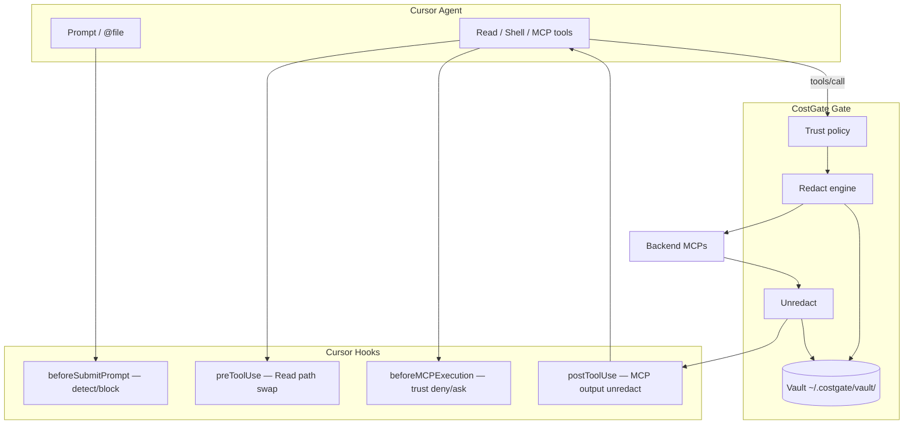

# Phase 31+ — CostGate Shield & MCP Trust (design & tasks)

> **Languages:** English (this file) · [日本語](../ja/dev/shield-trust.md)

MCP secret-leak prevention (Shield) and per-MCP trust levels.  
Security extension that **shares the same proxy insertion point** as cost reduction (Gate filter).

| Item | Content |
|------|---------|
| **Goal** | Reduce secrets sent to untrusted MCPs and LLM providers |
| **Non-goals (initial)** | Chat UI auto-restore, legal guarantees on LLM training, Cloud Agent |
| **Prerequisites** | Gate filter, Dashboard MCP control, Phase 28 prompt-intent |
| **Status** | Phases 31–33 **done** (PRs #63–#72). Phases 34–35 blocked on Cursor API |

### Enable

```bash
npx @costgate/cli@latest init    # mcp.json + hooks (includes Shield)
# or after clone: npm run cursor:registry
# hooks set COSTGATE_SHIELD=1, COSTGATE_SHIELD_SESSION=cursor
```

Gate-side redact: `COSTGATE_SHIELD=1` (also via `costgate-gate-launch.mjs`).

---

## 1. Background

`costgate-gate` proxies all backend MCP `tools/call`.  
In addition to cost savings, **redact / trust policy can apply at the same point**.

### Data paths to the LLM

```
User prompt ──────────────────────────────→ Cloud LLM (outside Gate)
@file / rules ─────────────────────────────→ Cloud LLM (outside Gate)
Agent Read / Shell / Grep ─────────────────→ Cloud LLM (hooks available)
MCP tools/call ────────────────────────────→ Gate (Shield primary)
```

**Hooks alone cannot rewrite full prompts or restore the UI today** (§6).  
Phases 31–33 implement MCP + Read paths first.

---

## 2. Architecture



---

## 3. MCP Trust

### 3.1 Trust levels

| Trust | Intended for | Redact | tools/list | tools/call |
|-------|--------------|--------|------------|------------|
| **trusted** | costgate-gate, verified | none | wider Tier B | allow |
| **standard** | default Gate backend | secrets only | current filter | allow |
| **restricted** | community / unverified | aggressive | read-oriented | write deny / ask |
| **untrusted** | blind-spot candidates | full | meta only | deny |

`disabled` (`mcp-disabled.json`) is **full stop**, stronger than untrusted.

### 3.2 Config files

```
~/.costgate/mcp-trust.json              # Global
<project>/.costgate/mcp-trust.json      # Project overlay (config-merge)
```

```json
{
  "version": 1,
  "defaults": {
    "gate_backend": "standard",
    "direct_mcp": "restricted",
    "unknown": "restricted"
  },
  "servers": {
    "costgate-gate": { "trust": "trusted", "source": "builtin" },
    "github": { "trust": "standard", "backend_key": "github" },
    "some-community-mcp": { "trust": "restricted" }
  }
}
```

**Resolution:** `servers[name]` → Marketplace (`official`) → `defaults` → `restricted`

### 3.3 Dashboard (implemented)

- MCP tab: Trust column (dropdown, PATCH `/api/mcp-trust`)
- Install defaults: `restricted` (community), `standard` (official)
- Overview: count of restricted-or-lower MCPs, Prompt Shield blocks
- Prompt Shield panel: detected kinds, masked snippets, sanitized copy (`POST /api/shield-prompt/sanitize`)

---

## 4. Shield — Redact / Vault

### 4.1 Placeholders

```
[[CG:EMAIL:7f3a]]  [[CG:PATH:9b2c]]  [[CG:AWS_KEY:1d4e]]
```

### 4.2 Vault

```
~/.costgate/vault/
  <session_id>.json   # placeholder → original (encryption recommended)
```

| Field | Gate reads |
|-------|------------|
| placeholder / keywords | ✅ |
| `ts` | ✅ TTL |
| original value | local only; never log |

### 4.3 Detection v1 (rule-based)

- AWS / GCP / Azure keys
- GitHub PAT (`ghp_`, `github_pat_`)
- Bearer / JWT
- Email / phone / card (Luhn)
- `.env` values, connection strings
- Custom: `~/.costgate/redact-rules.json`

### 4.4 Environment variables

| Variable | Default | Description |
|----------|---------|-------------|
| `COSTGATE_SHIELD` | `0` | Enable Gate / Hook redact |
| `COSTGATE_SHIELD_DIR` | `~/.costgate/vault` | Vault directory |
| `COSTGATE_SHIELD_SESSION` | `COSTGATE_CLIENT` → `"default"` | JS/Go shared vault session |
| `COSTGATE_TRUST_PATH` | `~/.costgate/mcp-trust.json` | Trust config (Go) |
| `COSTGATE_SHIELD_PROMPT` | — | `1` enables prompt block only |
| `COSTGATE_SHIELD_PROMPT_FAIL_OPEN` | — | `1` fail-open prompt block |
| `COSTGATE_SHIELD_PROMPT_AGGRESSIVE` | — | `1` include email/phone/path in prompt block |
| `COSTGATE_SHIELD_PROMPT_DIR` | `~/.costgate/shield-prompt/` | Block event storage |
| `COSTGATE_MARKETPLACE_DIR` | — | Go official catalog path |

---

## 5. Per-path — hide & restore

| Path | Hide | Agent restore | UI restore | Status |
|------|------|---------------|------------|--------|
| MCP `tools/call` | ◎ | ◎ Gate | △ | ✅ 31b (#64) |
| Agent `Read` | ◎ | ◎ path swap | △ | ✅ 32a–c (#68–#70) |
| User prompt | △ block | — | △ Dashboard copy | ✅ 33a–b (#71–#72) |
| Shell output | ✗ | ✗ | ✗ | out of scope |
| Agent response | ✗ | ✗ | ✗ | ⏸ Cursor API **35** |

---

## 6. Cursor Hook limits (as of 2026-07)

| Hook | Expected | Current |
|------|----------|---------|
| `beforeSubmitPrompt` | prompt redact | **no rewrite** (`continue` only) |
| `beforeReadFile` | content redact | **deny only** |
| `preToolUse` | Read path swap | **◎ `updated_input`** |
| `postToolUse` | Read redact | **MCP only** `updated_mcp_tool_output` |
| `postToolUse` | `additional_context` | **bug: not delivered to model** |
| `afterAgentResponse` | UI restore | **no output API** |

**LLM training:** hiding reduces exposure; opt-out is Privacy Mode / Enterprise ZDR.

---

## 7. Implementation phases

Phases 31–33 are **complete**. See the [Japanese doc](../ja/dev/shield-trust.md) for the full task checklist with PR numbers.

| Phase | Summary | Status |
|-------|---------|--------|
| **31** | Trust schema, Gate redact/vault, Dashboard edit, MCP hook, marketplace defaults | ✅ |
| **32** | Read sanitizer (`preToolUse`), cache, `cursor:registry` | ✅ |
| **33** | Prompt secret block, Dashboard UX + sanitize CLI | ✅ |
| **34** | Auto prompt redact | ⏸ Cursor API |
| **35** | Response UI restore | ⏸ Cursor API |

---

## 8. Relation to existing features

| Existing | Shield / Trust |
|----------|----------------|
| Tier A/B/C | trust overrides exposure ceiling |
| `mcp-disabled.json` | disabled > untrusted |
| blind_spots | not via Gate → default restricted + warning |
| compress / code-mode | reduces volume (complements Shield) |
| prompt-intent (28) | independent, coexists |

---

## 9. Risks

| Risk | Mitigation |
|------|------------|
| Over-redact breaks APIs | dry-run, per-field policy |
| Placeholders committed to git | pre-commit warning |
| Vault leak | OS keyring, short TTL |
| All MCPs set trusted | UI warning, default restricted on install |
| Hook bypass (direct MCP) | blind spot detection + Dashboard |

---

## 10. Recommended Cursor feature requests

1. `beforeSubmitPrompt` — redacted prompt or `additional_context` injection
2. `afterAgentResponse` — response transform for vault restore
3. `beforeReadFile` — redacted content output field
4. `postToolUse` — fix `additional_context` delivery to model

---

## 11. Related docs

- [prompt-intent-hook.md](./prompt-intent-hook.md) — Phase 28
- [architecture.md](../architecture.md) — Gate placement
- [dashboard.md](../dashboard.md) — MCP control UI

---

## Appendix — Trust × Redact matrix

| Trust | Redact strength | Write tools | Hook beforeMCP |
|-------|-----------------|-------------|----------------|
| trusted | off | allow | allow |
| standard | secrets | allow | allow |
| restricted | secrets + paths | deny/ask | ask |
| untrusted | full | deny | deny |
