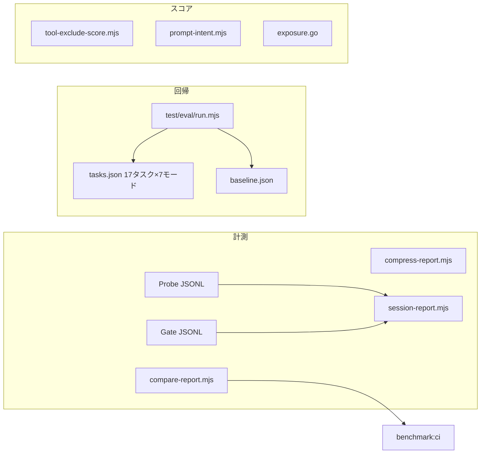
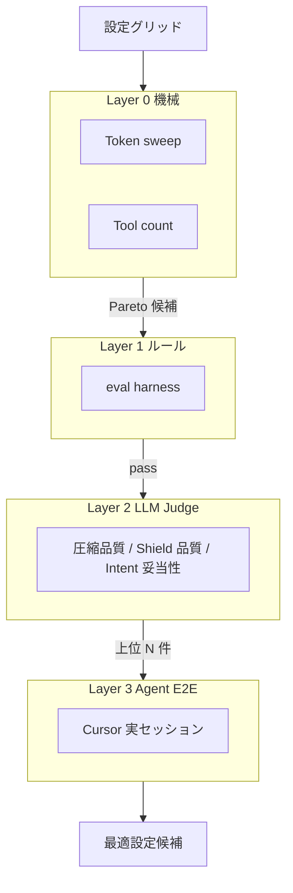

# 最適設定探索 — バッチ比較・LLM-as-judge 企画

> **言語:** [English](../dev/optimize-sweep.md) · 日本語（このファイル）

Tool 自動選択、スコアリング、Shield 設定などの **最適パラメータ探索** を、バッチ比較と LLM-as-judge で行うための企画整理。

| 項目 | 内容 |
|------|------|
| **目的** | コスト（tokens）と品質（タスク成功率・情報欠落）のトレードオフを定量化し、推奨設定を導出する |
| **非目的** | 学習ベース ranker の先行実装、全設定を Cursor E2E で毎回検証 |
| **前提** | Phase 17 eval harness、compare/compress report、prompt-intent、Shield、gate-settings hot-reload が稼働 |
| **関連** | [benchmarks.md](../benchmarks.md)、[prompt-intent-hook.md](./prompt-intent-hook.md)、[shield-trust.md](./shield-trust.md) |

---

## 1. 何を最適化したいか

| レイヤ | 調整対象 | 現状の制御手段 |
|--------|----------|----------------|
| **Tool 露出** | Tier A/B/C、exposure mode、token budget | `gate-settings.json`, env |
| **Intent 推定** | プロンプト / probe / usage の merge | prompt-intent hook, `COSTGATE_INTENT_*` |
| **Tool スコア** | `exclude_score`, `IntentRelevanceScore` | ヒューリスティック（手チューニング） |
| **Shield** | `prompt_block`, `aggressive`, `fail_open`, trust | `shield-settings.json` |
| **圧縮** | compress, code-mode | env / gate-settings |

**トレードオフの軸は 2 つ:**

```
コスト（tokens）  ←→  品質（タスク成功率・情報欠落・誤ツール選択）
```

現状の CI は **コスト側が強い**（`benchmark:ci`: ≥40% 削減など）。**品質側はルールベース eval のみ**で、LLM judge もエージェント軌道 eval も未実装。

---

## 2. 現状インフラ（使えるもの）



| 既存 | できること | できないこと |
|------|-----------|-------------|
| `compare-report.mjs` | 設定別 `tools/list` トークン比較 | パラメータグリッド一括実行 |
| `compress-report.mjs` | 定義+結果の総合削減率 | 圧縮で失った情報の評価 |
| `test/eval/run.mjs` | MCP 直呼び、文字列/件数 assert | エージェント全体の成功判定 |
| `tool-exclude-score.mjs` | 除外候補のランキング | eval へのフィードバックループ |
| `benchmark:ci` | トークン閾値の回帰検知 | 精度との Pareto 判定 |

**ギャップ:** バッチ sweep オーケストレータ、並列実行、LLM judge、セッション replay、token+accuracy 統合レポート。

### クイックリファレンス

```bash
# 定義レイヤ before/after（npm エイリアスなし — 直接実行）
node scripts/compare-report.mjs --mock --json

# 総合削減（定義 + 結果）
npm run compress-report -- --mock --json

# セッションログ分析
npm run session-report -- --json

# 精度ハーネス
npm run eval -- --json --diff test/eval/baseline.json

# CI 回帰
npm run benchmark:ci
```

---

## 3. 評価方式 — Cursor 以外も使うべきか

### 結論

| 用途 | 最適な実行環境 | 理由 |
|------|---------------|------|
| **トークン計測・設定 sweep** | CostGate 自前スクリプト（Cursor 不要） | 再現性・速度・コストが最良 |
| **MCP プロトコル正しさ** | `test/eval` ハーネス（Cursor 不要） | 既存、CI 統合済み |
| **「この設定で Agent は正しいツールを選ぶか」** | **Cursor Agent**（本番同等） | 実際のツール露出・プロンプト構造を再現 |
| **「圧縮/Shield で情報が壊れたか」** | **LLM-as-judge（外部 API）** | 大量ケースを安価にスコアリング |
| **長期ベンチマーク・論文級比較** | 外部 harness（Langfuse, Braintrust, OpenAI Evals 等） | ダッシュボード・履歴・A/B 基盤 |

**Cursor だけでは不十分な領域がある。** ただし **全部を Cursor で回すのも非効率**。役割分担が正解。

### 3 層評価モデル（推奨）

```
Layer 0 — 機械的（無 LLM）
  tokens, tool count, latency, JSON schema valid
  → compare-report, benchmark:ci
  → 高速・無料・CI 向き

Layer 1 — ルールベース品質
  assert_text_contains, min_count, symbol match
  → test/eval/run.mjs（現状）
  → 「正しいツールが list に載るか」まで

Layer 2 — LLM-as-judge
  「圧縮後でもタスクに必要な情報が残っているか」
  「Shield 後でも意図が伝わるか」
  → 外部 API（Haiku / GPT-4o-mini 等）で batch 判定

Layer 3 — Agent E2E（少数・高コスト）
  実 Cursor セッション or Cursor SDK
  → 本番に近い「初回ターンで discover せず済むか」
  → 週次・リリース前のみ
```



**Layer 0→1→2→3 のフィルタ漏斗**にすると、Cursor / 高コスト judge の呼び出しを最小化できる。

---

## 4. LLM-as-judge の適用箇所

| 判定対象 | Judge プロンプト例 | 入力 | 出力 |
|----------|-------------------|------|------|
| **圧縮品質** | 「元レスポンスにあった事実が圧縮版に残っているか」 | original / compressed pair | 0–5 + 欠落リスト |
| **Intent 妥当性** | 「このプロンプトに必要なツールカテゴリは何か」 | user prompt + exposed tools | recall@k 相当 |
| **Shield 副作用** | 「redact 後でもエージェントがタスクを理解できるか」 | before/after shield | pass/fail + 理由 |
| **exclude 判断** | 「このツールを隠しても今回のタスクに影響しないか」 | prompt + hidden tool desc | risk score |

**注意点:**

- Judge 自体もトークンコストがかかる → **安いモデル + バッチ**（OpenAI Batch API, Anthropic 等）
- Judge のブレ → **複数回投票 or 固定 rubric + 温度 0**
- **本番 Cursor モデルと judge モデルを分ける**のは妥当（judge は「品質ラベラー」）

[prompt-intent-hook.md](./prompt-intent-hook.md) でも **「LLM 分類は v2」** と明記済み。バッチ最適化フェーズで Layer 2 に入れるのが自然。

---

## 5. バッチ比較パイプライン案

### Phase A — Sweep Runner（インフラ、LLM 不要）✅ P6a

```bash
npm run optimize:sweep -- --mock \
  --grid exposure_mode=conservative,aggressive,budget \
  --grid intent_source=env,probe \
  --tasks test/eval/sweep-tasks.json \
  --out reports/sweep.json

# トークン計測のみ（高速 smoke）
npm run optimize:sweep:smoke
```

| パス | 役割 |
|------|------|
| `scripts/optimize-sweep.mjs` | CLI — グリッド sweep |
| `scripts/lib/optimize-sweep.mjs` | グリッド展開、トークン計測、eval、Pareto |
| `scripts/lib/eval-harness.mjs` | eval 共通（`test/eval/run.mjs` からも利用） |
| `test/eval/sweep-tasks.json` | sweep 用 config 非依存タスク |

**各セルで記録:** `tools_list_tokens`, `tool_count`, `token_reduction_pct`, `eval_pass_rate`, `p50_duration_ms`, `pareto`

### Phase B — 統合レポート（token × pass rate）✅ P6b

`sweep` 出力 JSON の `summary` + `pareto` + `results[]` に統合。CLI は Markdown 表も表示。

### Phase C — セッション Replay Fixture ✅ P6c

```bash
npm run session-replay:export -- \
  --file test/fixtures/dashboard/probe-sample.jsonl \
  --session sess-001 \
  --out test/eval/replay-fixtures/sample-github-session.json

npm run optimize:sweep -- --mock \
  --replay test/eval/replay-fixtures/sample-github-session.json \
  --tasks test/eval/sweep-tasks.json
```

| パス | 役割 |
|------|------|
| `scripts/session-replay-export.mjs` | CLI — export / `--list` |
| `scripts/lib/session-replay.mjs` | パース、fixture 変換、eval task 化 |
| `test/eval/replay-fixtures/` | コミット済み replay fixture |

### Phase D — LLM Judge バッチ

#### P7a — 圧縮品質 judge ✅

```bash
# fixture のみ（CI / smoke）
npm run judge:compress:smoke

# Gate から original/compressed ペアを収集して判定
npm run judge:compress -- --mock --collect --json

# 外部 API（要 API key）
COSTGATE_JUDGE_PROVIDER=openai npm run judge:compress -- --collect
COSTGATE_JUDGE_PROVIDER=anthropic npm run judge:compress -- --collect
```

| パス | 役割 |
|------|------|
| `scripts/compress-judge.mjs` | CLI |
| `scripts/lib/llm-judge.mjs` | provider 抽象（mock / OpenAI / Anthropic） |
| `scripts/lib/compress-judge.mjs` | rubric、ペア収集、バッチ判定 |
| `test/fixtures/compress-judge/` | オフライン fixture |

環境変数: `COSTGATE_JUDGE_PROVIDER`, `COSTGATE_JUDGE_MODEL`, `OPENAI_API_KEY`, `ANTHROPIC_API_KEY`

#### P7b — Shield 副作用 judge ✅

```bash
npm run judge:shield:smoke
npm run judge:shield -- --mock --collect --json
```

| パス | 役割 |
|------|------|
| `scripts/shield-judge.mjs` | CLI |
| `scripts/lib/shield-judge.mjs` | rubric、ペア収集、判定 |
| `test/fixtures/shield-judge/` | オフライン fixture |

#### P7c — Dashboard eval 検証 ✅

Gate 設定パネルの **「eval で検証」** ボタン → `POST /api/admin/gate-eval`

| パス | 役割 |
|------|------|
| `scripts/lib/dashboard-gate-eval.mjs` | mock sweep tasks で token × pass rate |
| `scripts/dashboard-ui/app.js` | UI ボタン + トースト |

```
sweep 結果の Pareto 前沿（token↓ & eval pass）
  → 各設定で compress/shield の before/after ペアを生成
  → judge API に batch 投入
  → quality_score を sweep 結果に join
```

**出力例:**

| config_id | tokens | eval_pass | judge_quality | recommend |
|-----------|--------|-----------|---------------|-----------|
| aggressive_8k_prompt | 4200 | 16/17 | 4.2 | ★ |
| budget_12k_probe | 5100 | 17/17 | 4.8 | ★★ |

### Phase E — Cursor Agent E2E（スポット検証）✅ P8

```bash
# mock proxy layer（CI / 週次）
npm run cursor:e2e:spot:smoke

# 全プロンプト + デフォルト設定
npm run cursor:e2e:spot -- --mock --json

# sweep Pareto 上位 N 設定
npm run cursor:e2e:spot -- --mock --sweep reports/sweep.json --top 3

# 手動 Cursor 検証用チェックリスト
npm run cursor:e2e:spot -- --mock --checklist reports/cursor-e2e-checklist.md
```

| パス | 役割 |
|------|------|
| `scripts/cursor-e2e-spot.mjs` | CLI |
| `scripts/lib/cursor-e2e-spot.mjs` | プロンプト × 設定の spot 実行 |
| `test/eval/cursor-e2e-prompts.json` | 固定プロンプトセット（8件） |
| `.github/workflows/cursor-e2e-spot.yml` | 週次 workflow（mock） |

**記録:** pass rate、`discover_tools` 必要率、意図キーワード。本番 Cursor Agent は `--checklist` で手動追跡。

---

## 6. 最適化対象パラメータ空間

### 優先度高（効果大・既存フラグあり）

| パラメータ | 探索範囲 | 計測 |
|-----------|---------|------|
| `exposure_mode` | conservative / aggressive / budget | L0 + L1 |
| `exposure_token_budget` | 6k–20k | L0 |
| `intent_source` | env / probe / prompt / merge weights | L1 |
| `COSTGATE_COMPRESS` | on/off × 閾値 | L0 + L2 |
| Shield `aggressive` | on/off | L2 + L3 |

### 優先度中（要実装）

| パラメータ | 備考 |
|-----------|------|
| `IntentRelevanceScore` 重み | Go 定数の sweep → コード変更 or 設定化が先 |
| `exclude_score` 閾値 | Dashboard 推奨と eval の接続 |
| prompt-intent タグ重み | `prompt-intent.mjs` の regex スコア |

### 優先度低（研究フェーズ）

- 学習ベース tool ranker
- 動的 tier 再分類

---

## 7. システム選定マトリクス

| システム | Layer | 長所 | 短所 | 推奨用途 |
|---------|-------|------|------|---------|
| **CostGate scripts** | 0–1 | 無料・再現・CI | Agent 行動は見えない | 日常 sweep |
| **test/eval harness** | 1 | 既存・決定的 | シナリオ限定的 | 回帰ゲート |
| **LLM API (judge)** | 2 | 意味品質・大量 | コスト・ブレ | 圧縮/Shield 品質 |
| **Cursor IDE Agent** | 3 | 本番同等 | 遅い・非決定的・自動化難 | 最終確認 |
| **Cursor SDK** | 3 | 半自動 E2E | IDE 差・β | 週次バッチ |
| **Langfuse / Braintrust** | 横断 | 実験管理・履歴 | 導入コスト | 本格 R&D 期 |
| **costgate-cloud** | 横断 | 本番メトリクス集約 | 別 repo | フィールドデータ収集 |

**Cursor は Layer 3 専用**に留め、**探索の 90% は Layer 0–2 で回す**のがコスト効率が良い。

---

## 8. 推奨ロードマップ

| 段階 | 成果物 | 期間感 | LLM |
|------|--------|--------|-----|
| **P6a** | `optimize:sweep.mjs` — グリッド runner + JSON 集計 | ✅ Done |
| **P6b** | eval と benchmark の **統合レポート**（token × pass rate） | ✅ Done |
| **P6c** | セッション replay fixture（Probe JSONL → seed） | ✅ Done |
| **P7a** | LLM judge モジュール（圧縮品質） | ✅ Done |
| **P7b** | Shield 副作用 judge | ✅ Done |
| **P7c** | Dashboard「推奨設定を eval で検証」ボタン | ✅ Done |
| **P8** | Cursor E2E スポット（週次 workflow） | ✅ Done |

---

## 9. 意思決定

### やるべきこと

1. **Sweep runner を最優先** — 既存 `compare-report` + `eval` のラッパーで十分 MVP
2. **LLM judge は Layer 2 に限定** — compress / shield 品質から着手（ROI 高）
3. **Cursor Agent は最終ゲート** — sweep+judge の上位候補だけ人間/Agent で spot check
4. **本番ログ → fixture 化** — 合成タスクより価値が高い

### やらないこと（今は）

- 全パラメータを Cursor で毎回 E2E（遅くて再現性低い）
- Judge を CI 必須ゲートに（コスト・フレーク）
- 学習ベース ranker の先行実装（ヒューリスティック sweep で上限が見えてから）

### オープンな設計判断

| 論点 | 選択肢 |
|------|--------|
| Judge モデル | 固定 mini 系 vs 本番モデルと同系統 |
| 最適設定の適用 | 手動適用 vs Dashboard ワンクリック vs 自動 A/B |
| 実験データ | ローカル JSON only vs costgate-cloud 集約 |

---

## 10. 次のアクション

1. **P6a 仕様確定** — sweep の grid 形式・出力スキーマを本ドキュメントに追記
2. **代表グリッド 1 本実行** — exposure_mode × intent_source × 現行 `tasks.json`
3. **Pareto 図** — token reduction vs eval pass rate（手動でも可）
4. **judge rubric 草案** — 圧縮品質 5 段階評価のプロンプト 1 本
5. **Cursor spot check 手順** — 上位 3 設定 × 5 プロンプトのチェックリスト

---

## まとめ

Cursor Agent は **「本番同等の最終検証」**には最適だが、**バッチ探索・スコア較正・圧縮品質判定**には向かない。**CostGate 自前 sweep + ルール eval + 安価 LLM judge** の 3 段構成が、コスト・再現性・本番近似のバランスが最も良い。
