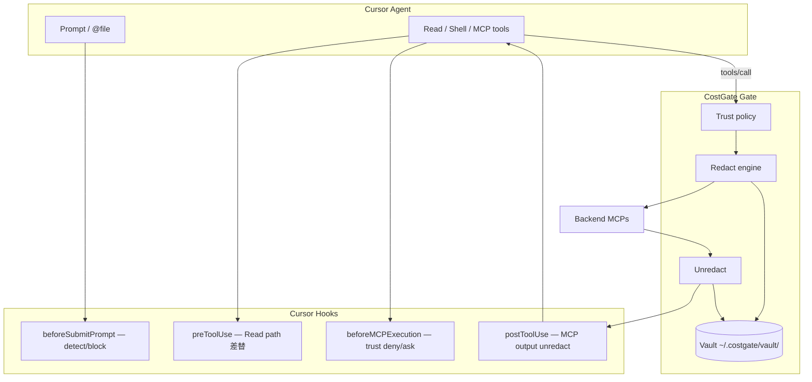

# Phase 31+ — CostGate Shield & MCP Trust（設計・タスク）

> **言語:** [English](../dev/shield-trust.md) · 日本語（このファイル）

MCP 経由の機密漏洩防止（Shield）と MCP ごとの信頼度（Trust）設定。  
コスト削減（Gate filter）と **同一プロキシ挿入点** で共存するセキュリティ拡張。

| 項目 | 内容 |
|------|------|
| **目的** | 悪意・過剰権限 MCP や LLM プロバイダへの機密送信を低減 |
| **非目的（初期）** | チャット UI の自動復元、LLM 学習の法的保証、Cloud Agent |
| **前提** | Gate filter、Dashboard MCP 制御、Phase 28 prompt-intent |
| **実装状況** | Phase 31–33 **完了**（PR #63–#72）。Phase 34–35 は Cursor API 待ち |

### 有効化

```bash
npx @costgate/cli@latest init    # mcp.json + hooks（Shield 含む）
# または clone 後: npm run cursor:registry
# hooks には COSTGATE_SHIELD=1, COSTGATE_SHIELD_SESSION=cursor が設定される
```

Gate 側 redact は `COSTGATE_SHIELD=1`（`costgate-gate-launch.mjs` 経由でも可）。

---

## 1. 背景

CostGate は `costgate-gate` が全 backend MCP の `tools/call` を中継する。  
コスト削減に加え、**同一点で redact / trust policy を適用**できる。

### LLM へ載るデータ経路

```
User prompt ──────────────────────────────→ Cloud LLM（Gate 外）
@file / rules ─────────────────────────────→ Cloud LLM（Gate 外）
Agent Read / Shell / Grep ─────────────────→ Cloud LLM（Hook 可）
MCP tools/call ────────────────────────────→ Gate（Shield 主戦場）
```

**Hook だけではプロンプト全文の書換・UI 復元は現状不可**（§6）。  
MCP + Read 経路を Phase 31–33 で先行実装する。

---

## 2. アーキテクチャ



---

## 3. MCP Trust（信頼度）

### 3.1 信頼レベル

| Trust | 想定 | Redact | tools/list | tools/call |
|-------|------|--------|------------|------------|
| **trusted** | costgate-gate, 検証済み | なし | 広め Tier B | allow |
| **standard** | Gate backend 既定 | secret のみ | 現行 filter | allow |
| **restricted** | コミュニティ / 未検証 | 積極的 | Read 系中心 | write deny / ask |
| **untrusted** | blind spot 候補 | 全面 | meta のみ | deny |

`disabled`（既存 `mcp-disabled.json`）は trust より強い **完全停止**。

### 3.2 設定ファイル

```
~/.costgate/mcp-trust.json              # Global
<project>/.costgate/mcp-trust.json      # Project 上書き（config-merge パターン）
```

```json
{
  "version": 1,
  "defaults": {
    "gate_backend": "standard",
    "direct_mcp": "restricted",
    "unknown": "restricted"
  },
  "servers": {
    "costgate-gate": { "trust": "trusted", "source": "builtin" },
    "github": { "trust": "standard", "backend_key": "github" },
    "some-community-mcp": { "trust": "restricted" }
  }
}
```

**解決順:** `servers[name]` → Marketplace（`official`）→ `defaults` → `restricted`

### 3.3 Dashboard（実装済み）

- MCP タブ: Trust 列（dropdown、PATCH `/api/mcp-trust`）
- 初回 install 既定: `restricted`（community）、`standard`（official）
- Overview: restricted 以下の MCP 件数、Prompt Shield ブロック件数・最終ブロック
- Prompt Shield パネル: 検出種別・マスク済みスニペット、サニタイズ版コピー（`POST /api/shield-prompt/sanitize`）

---

## 4. Shield — Redact / Vault

### 4.1 プレースホルダ

```
[[CG:EMAIL:7f3a]]  [[CG:PATH:9b2c]]  [[CG:AWS_KEY:1d4e]]
```

### 4.2 Vault

```
~/.costgate/vault/
  latest-map.json          # session スコープ索引（任意）
  <conversation_id>.json   # placeholder → 原文（暗号化推奨）
```

| フィールド | Gate が読む |
|-----------|------------|
| `keywords` / placeholder | ✅ |
| `ts` | ✅ TTL |
| 原文 | ローカルのみ、ログに出さない |

### 4.3 検出 v1（ルールベース）

- AWS / GCP / Azure keys
- GitHub PAT (`ghp_`, `github_pat_`)
- Bearer / JWT
- メール / 電話 / カード（Luhn）
- `.env` 値、connection strings
- `~/.costgate/redact-rules.json` カスタム

### 4.4 環境変数

| Variable | Default | Description |
|----------|---------|-------------|
| `COSTGATE_SHIELD` | `0` | Gate / Hook redact 有効化 |
| `COSTGATE_SHIELD_DIR` | `~/.costgate/vault` | Vault ディレクトリ |
| `COSTGATE_SHIELD_SESSION` | `COSTGATE_CLIENT` → `"default"` | JS/Go vault 共有セッション ID |
| `COSTGATE_TRUST_PATH` | `~/.costgate/mcp-trust.json` | Trust 設定（Go） |
| `COSTGATE_SHIELD_PROMPT` | — | `1` で prompt block のみ有効（`COSTGATE_SHIELD` でも可） |
| `COSTGATE_SHIELD_PROMPT_FAIL_OPEN` | — | `1` で prompt block を fail-open |
| `COSTGATE_SHIELD_PROMPT_AGGRESSIVE` | — | `1` で email/phone/path も prompt block 対象 |
| `COSTGATE_SHIELD_PROMPT_DIR` | `~/.costgate/shield-prompt/` | ブロックイベント保存先 |
| `COSTGATE_MARKETPLACE_DIR` | — | Go 側 official 判定用 catalog |

---

## 5. 経路別 — 隠匿・復元の可否

| 経路 | 隠匿 | Agent 復元 | UI 復元 | 実装 |
|------|------|-----------|---------|------|
| MCP `tools/call` | ◎ | ◎ Gate | △ | ✅ **31b** (#64) |
| Agent `Read` | ◎ | ◎ path 差替 | △ | ✅ **32a–c** (#68–#70) |
| User prompt | △ block | — | △ Dashboard コピー | ✅ **33a–b** (#71–#72) |
| Shell 出力 | ✗ | ✗ | ✗ | 対象外 |
| Agent 応答 | ✗ | ✗ | ✗ | ⏸ Cursor API 待ち **35** |

---

## 6. Cursor Hook 制限（調査結果）

| Hook | 期待 | 現状（2026-07） |
|------|------|----------------|
| `beforeSubmitPrompt` | プロンプト redact | **書換不可**（`continue` のみ） |
| `beforeReadFile` | 内容 redact | **deny のみ** |
| `preToolUse` | Read path 差替 | **◎ `updated_input`** |
| `postToolUse` | Read 結果 redact | **MCP のみ** `updated_mcp_tool_output` |
| `postToolUse` | `additional_context` | **バグでモデル未達** |
| `afterAgentResponse` | UI 復元 | **出力 API なし** |

**LLM 学習防止:** 隠匿は露出低減。学習 opt-out は Privacy Mode / Enterprise ZDR が本筋。

---

## 7. 実装フェーズ & タスク

### Phase 31 — Shield + Trust（MCP 境界） ✅

| PR | タスク | 成果物 | 状態 |
|----|--------|--------|------|
| **31a** | Trust スキーマ + Dashboard 読取 | `mcp-trust.json`, API overview | ✅ #63 |
| **31b** | Gate redact/unredact + vault | `packages/gate/internal/shield/`, env | ✅ #64 |
| **31c** | Dashboard Trust 編集 UI | MCP タブ dropdown, PATCH API | ✅ #65 |
| **31d** | Hook `beforeMCPExecution` × trust | `cursor-shield-mcp-hook.mjs` | ✅ #66 |
| **31e** | Marketplace 既定 trust + eval | `tasks.json`, baseline | ✅ #67 |

**31a 詳細タスク:**
- [x] `scripts/lib/mcp-trust.mjs` — load/merge/resolve
- [x] `buildDashboardData` に trust 列追加
- [x] `test/mcp-trust.test.mjs`

**31b 詳細タスク:**
- [x] `shield/redact.go` — pattern + JSON field walk
- [x] `shield/vault.go` — read/write TTL map
- [x] `proxy/forward.go` — tools/call 前後に挿入
- [x] `COSTGATE_SHIELD=1` で有効化
- [x] Go tests + eval `shield_redacts_github_token`

**31c 詳細タスク:**
- [x] `PATCH /api/mcp-trust` + workspace 版
- [x] MCP タブ Trust dropdown（save-on-change）
- [x] trust バリデーション + テスト

**31d 詳細タスク:**
- [x] `cursor-shield-mcp-hook.mjs` — trust matrix (allow/ask/deny)
- [x] `install-cursor-registry-hook.mjs` 登録
- [x] `test/cursor-shield-mcp-hook.test.mjs`

**31e 詳細タスク:**
- [x] Marketplace install 既定 trust（official→standard, community→restricted）
- [x] Go `IsOfficialMarketplace` catalog 連動
- [x] eval `shield_trust_blocks_untrusted_mcp`

---

### Phase 32 — Read Sanitizer（コード隠匿） ✅

| PR | タスク | 成果物 | 状態 |
|----|--------|--------|------|
| **32a** | `preToolUse` Read path 差替 | `cursor-shield-read-hook.mjs` | ✅ #68 |
| **32b** | サニタイズ cache + vault 共有 | `.costgate/sanitized/` | ✅ #69 |
| **32c** | `npm run cursor:registry` 統合 | hooks.json merge | ✅ #70 |

**32a 詳細タスク:**
- [x] Read `preToolUse` matcher
- [x] 原文 → redact → shadow file 書込
- [x] `updated_input.path` を shadow に差替
- [x] `test/cursor-shield-read-hook.test.mjs`

**32b 詳細タスク:**
- [x] `shield-cache.mjs` — mtime/hash キャッシュ（`.cgmeta.json`）
- [x] JS/Go vault セッション共有（`COSTGATE_SHIELD_SESSION`）
- [x] trust → redact mode（`shield-trust.mjs`）
- [x] バイナリ skip（`shield-binary.mjs`）
- [x] `.gitignore` に `.costgate/sanitized/`

**32c 詳細タスク:**
- [x] `preToolUse` Read を `cursor:registry` に登録
- [x] Shield env 共有（`COSTGATE_SHIELD=1`, `COSTGATE_SHIELD_SESSION=cursor`）
- [x] `test/install-cursor-registry-hook.test.mjs`

---

### Phase 33 — Prompt 保護（ブロック + UX） ✅

| PR | タスク | 成果物 | 状態 |
|----|--------|--------|------|
| **33a** | `beforeSubmitPrompt` secret 検出 block | `cursor-shield-prompt-hook.mjs` | ✅ #71 |
| **33b** | Dashboard: ブロック理由 + サニタイズ版提案 | UI / CLI | ✅ #72 |

**33a 詳細タスク:**
- [x] `inferSecrets(prompt)` — `shield-redact.mjs` 共有ルール
- [x] `{ continue: false, user_message }`
- [x] fail-closed 既定（`COSTGATE_SHIELD_PROMPT_FAIL_OPEN=1` で切替）

**33b 詳細タスク:**
- [x] ブロックイベント保存（`shield-prompt.mjs`）
- [x] Dashboard Overview + ブロックパネル（種別・スニペット・サニタイズ版）
- [x] `GET /api/shield-prompt`, `POST /api/shield-prompt/sanitize`
- [x] CLI `npm run shield:sanitize-prompt`
- [x] `COSTGATE_SHIELD_PROMPT_AGGRESSIVE` 対応

---

### Phase 34 — Cursor API 待ち（プロンプト自動 redact） ⏸

| 条件 | タスク |
|------|--------|
| `beforeSubmitPrompt` が `additional_context` or redact API 対応 | Hook で prompt 差替 + vault |
| 未対応 | Cursor feature request 継続、33b UX で運用 |

---

### Phase 35 — 応答復元（Cursor API 待ち） ⏸

| 条件 | タスク |
|------|--------|
| `afterAgentResponse` が transform 出力対応 | placeholder → 原文 UI 復元 |
| 未対応 | Agent/MCP コンテキスト内 unredact のみ（31b） |

---

## 8. 既存機能との関係

| 既存 | Shield / Trust |
|------|----------------|
| Tier A/B/C | trust が露出上限を上書き |
| `mcp-disabled.json` | disabled > untrusted |
| blind_spots | 未 Gate 化 → 既定 restricted + 警告 |
| compress / code-mode | 露出「量」削減（Shield と併用） |
| prompt-intent (28) | 独立、共存 |

---

## 9. リスク

| リスク | 対策 |
|--------|------|
| 過剰 redact で API 失敗 | dry-run、per-field policy |
| placeholder が git commit | pre-commit 警告 |
| vault 漏洩 | OS keyring、短命 TTL |
| trust を全部 trusted | UI 警告、初回 restricted |
| Hook バイパス（直結 MCP） | blind spot + Dashboard |

---

## 10. Cursor への Feature Request（推奨）

1. `beforeSubmitPrompt` — redacted prompt or `additional_context` injection
2. `afterAgentResponse` — response transform for vault restore
3. `beforeReadFile` — redacted content output field
4. `postToolUse` — fix `additional_context` delivery to model

---

## 11. 関連ドキュメント

- [prompt-intent-hook.md](./prompt-intent-hook.md) — Phase 28
- [architecture.md](../architecture.md) — Gate 配置
- [dashboard.md](../dashboard.md) — MCP 制御 UI

---

## 付録 — Trust × Redact マトリクス

| Trust | Redact 強度 | Write tools | Hook beforeMCP |
|-------|------------|-------------|----------------|
| trusted | off | allow | allow |
| standard | secrets | allow | allow |
| restricted | secrets + paths | deny/ask | ask |
| untrusted | full | deny | deny |
